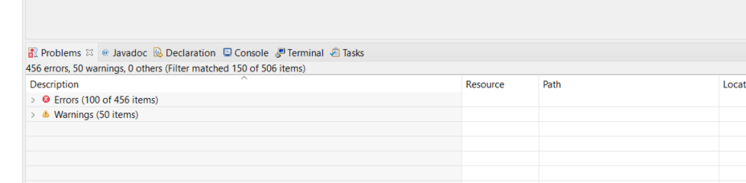
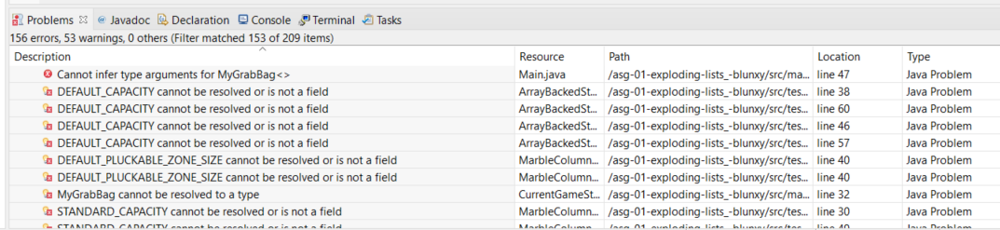
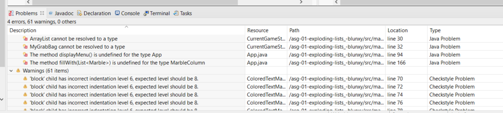

# F+ Level Overview

If you don't want an F, then **no compilation errors can be present in your project**.  

**NONE.**

What this means in practical terms is that any compilation error must be squashed by either writing working code - or writing stubs that shut the compiler up.

When you start this project, you're obviously going to be writing a lot of stubs! 

Fortunately, your IDE makes that super easy, so make sure you let Eclipse do much of the heavy lifting at this point.

## Doing this without going insane

Ok - when you open the project in Eclipse, you'll likely see in the Problems view that there are a LOT of Errors and a goodly number of Warnings.

Like, I just opened up a fresh version of the starting project, and I'm seeing **this** lovely sight:



First off: don't panic. I'll walk you through how to make a lot of them go away in an automated fashion - but you're still going to have to show some basic Java know-how. You won't be able to blindly accept suggestions from an automated tool and hope for the best.

## step 1 - implement those interfaces

First, I'd suggest getting all the classes in `main.datastructs` that are *supposed* to be implementing interfaces *actually* implementing the interfaces:

1. `ArrayBackedStack<T>` has to implement the `NewfangledStack<T>` iterface
2. `ExplodingIndexablePluckableQueue<T>` has to implement `PluckableQueue<T>` AND `ExplosivelyPluckable<T>` AND `IndexableCursor`  
3. `ListBackedPluckableQueue<T>` has to implement `PluckableQueue<T>`
4. `MyGrabBag<T>` has to implement the `GrabBag<T>` interface


  
  > _During this process, you'll need to import the interfaces from `main.interfaces` AND then get Eclipse to stub out the unimplemented interface methods for you._
  
Just doing these things should kill about 300 errors(!!!):



## step 2 - shut the tests up by stubbing what you can

Next, I'd start working my way up through the tests that are showing errors, working "up" from D to D+ to C etc. 

For each failing test, **start at the first error in the file** and fix it by stubbing. Work your way down, error by error, in the file, until all the compile errors are gone. Then move to the next file and repeat the process. [Here is a video](https://youtu.be/WyQBoCuJO_A) where I walk through the process and fix the D level tests.

When you get to stubbing out things in `MarbleColumn`, please read the **STUBBING HINTS** section in its docs.


  > _This step will test your ability to read and understand the code in the tests. Don't use the auto-suggested fixes without first considering what they're suggesting...the auto-suggests sometimes make **bad** suggestions! (I would actually suggest fixing all this stuff manually - I know that's now what you want to hear, but welcome to the uphill battle called learning.)_  

  
After all this stubbing, we're down to just 4 errors!



## step 3 - finish the stubwork: the final 4

You should have 4 errors left by this point, 2 in `CurrentGameState` and 2 in `App`:

1. `CurrentGameState` 
   1. the ArrayList error? Easy fix.
   2. the MyGrabBag error will likely require you to change your copy constructor in MyGrabBag a bit. Currently, you've probably got something like

    ```java
    public MyGrabBag(MyGrabBag<T> other) {
      // blah
    }
    ```
    But the parameter should be anything that's from the `GrabBag` interface - so we could create a copy of anything that was from that interface:
  
    ```java
    public MyGrabBag(GrabBag<T> other) {
      // blah
    }
    ```
    
2. `App`
   1. the `displayMenu` issue is an easy fix
      1. [UPDATE: 2021-02-05] I'm fine with folks commenting out any errors **happening in `App.java`**.
   2. the last error should be easy as well

## step 4 (optional) - get rid of as many Warnings as you can

This is a good opportunity to beat down the Warnings a bit (after all, they're gonna have to be beat down eventually, right?).

Nevertheless, maybe you're not in the mood? Your choice.

To encourage you a bit: 

- any Warning that's from Checkstyle? Just hit space somewhere in the file and then save - that awesome google-format drop-in will make **most, if not all** of those Warnings go away. There may be a few you'll have to act upon manually, though.
- I'd ignore your PMD Warnings at this time - most of them are caused by the stubbing process. You can clean them up later as you go!

## step 5 (optional) - do a test submit

Just as a sanity check, why not get your current work back on GitHub and then submit it? (Don't worry - you can resubmit when you're really done - I'm not even looking at marking these until after the deadline!) Doing this has two benefits:

1. if there are any weird submission-related errors, it's better to bump into them NOW, when there's lots of time to react, than LATER when the deadline's getting up in your grill
2. you've just created a backup of all your hard work! In fact, I'd suggest pushing up to GitHub after **every** grade level you complete; that way, you'll have backups of all your work!