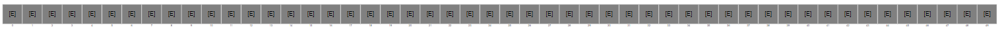
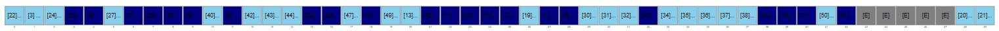
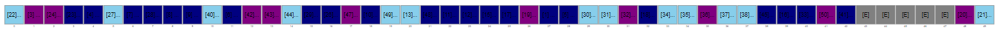
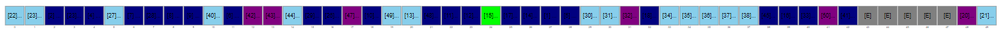
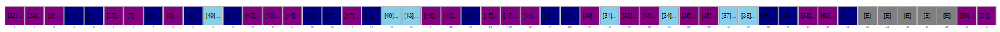
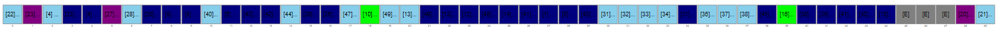
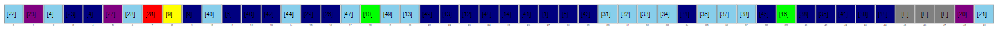
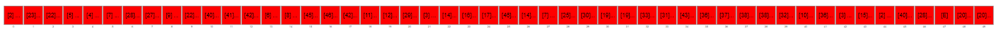

### The Path of the A+

#### WARNING: This path is totally different from the previous ones! It uses Arrays from BRIDGES instead of Linked Lists.

> _NOTE FROM JP:_  
> I'm kinda bummed, because the visualization for linked lists is *much* cooler than those for arrays. Sad now.

This level actually has the sweetest payoff, but does require you to put some work in.

On the other hand, this work overlaps [drill checkpoint 6](https://github.com/MRU-CSIS-2503-202101-001/course-resources/blob/main/drill-checkpoints.md#checkpoint-6-aka-choose-your-own-hashventure) a bunch...which means you're potentially killing two birds with one stone: completing the drill makes this assignment level significantly easier, so you get the 2% for completing the drill PLUS a solid mark for the assignment. Pretty tempting....

At this level, you will need to do these 5 things:

1. create an open-addressed hash table that uses linear probing; the backing "array" will be an Array1D object from the BRIDGES API

    > _I would have liked to have made a chained hash table an option, but unfortunately BRIDGES doesn't have a way to visualize a mixed structure like that (where you have an array filled with linked lists)_

    While you do NOT have to handle resizing, you have to use lazy deletion to handle deletes.
    
    The hash table should hold about 50 items; while BRIDGES _will_ let you add up to 5000 items, looking at such a large array sucks. Hard.

2. load the same number items as your array capacity into a List of some sort from a CSV you find on Kaggle.

    > _So, for example, if you decide to have a hash table of size 50, you'll load 50 items from your CSV into your List._

3. use the List to do the following:
      1. shuffle the List and then add 90% of its contents to your hash table, then
      2. remove 20% of the items in the list from the hash table, then
      3. shuffle the List again and add 10% of its contents to your hash table, then
      4. remove 50% of the items in the list from the hash table, then
      5. shuffle the List a final time and add 50% of its contents to your hash table
   
4. do two get (or contains) operations on your hash table:
      1. the first operation should be for an element you know to be in the hash table
      2. the second operation should be for an element you know to NOT be in the hash table 

5. add code so that array elements are colored based on certain situations. You have to:
    1. use one color for empty slots
    2. use another color for slots that were filled on the first try during a put operation
    3. use another color for slots that wound up in a slot other than their "home" slot during a put operation
    4. use another color for slots that had their value changed during a put operation
    5. use another color for slots that were probed during a get operation
    6. use another color for slots that were found successfully during a get operation

### Completed Example

Here's an example of the result from a completed A level project. I chose UFO sighting data from Kaggle. 

_Here's the empty hash table of size 50. All empty cells are grey._

---

_The first round of additions happen. Elements that got to their "home" index on the first try are light blue; the dark blue ones had some sort of collision along the way and needed to find a new home via linear probing. You can still see a few empty cells are left, too._

---

_The first round of deletions happen - they're the purple cells._

---

_The next round of additions happen - that one green cell? He's a cell who's had his value changed - since we're adding in the same data, it's actually the same value, but whatever._

---

_The next round of deletions happen - this should open up some space..._

---

_The final round of additions happen - 2 more greenies and a few of the empty cells were finally filled._

---

_The first get had to probe once - that's the red cell - before it found what it was looking for (the yellow cell)._

---

_And the final get - which is meant to fail - results in a probe of every cell of the table in a vain attempt to find something that's not there!_

## Adding a key

If you need to add a key field to the data you get from Kaggle, that's OK.

For example, I added an id field (just a unique number starting at 1 and going up for each record) to the UFO Sightings dataset that seemed interesting to me.