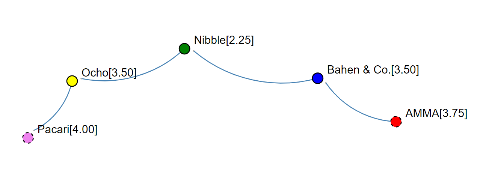

### The Path of the D+

This path is for those who are super-short on time (or super-crispy Burnt Out) and just want something super-simple to do at the end of the semester and are willing to take a "meh" mark in exchange.

At this level, you will need to do these 3 things:

1. create a generic singly or doubly-linked list class that uses the BRIDGES API,
2. create a *very* simple client that populates an instance of your list with 5 items of your own choosing that you manually insert into your list, and
3. color the nodes of the list different colors (so that's 10 different colors)

If this sounds difficult, here are some things to reassure you that it's not:

- you've already created code for both singly-linked and doubly-linked lists in the drills and assignment one, so your first task is basically complete already - you *will* have to make some **minor** adjustments, but we're talking maybe 15 minutes of find-and-replace
- grabbing a CSV from Kaggle, choosing 10 things out of it, and adding those things to your list is maybe 15 minutes of work (30 if you count setting up your Kaggle account and finding a CSV)
- there are tutorials on the BRIDGES site showing how to color nodes

**I estimate the time required to finish this level to be in the 1 to 2 hour range, assuming you have completed drills involving linked lists and/or assignment one.**

### Completed Example

Here's an example of the result from a completed D+ level project. I chose chocolate ratings from Kaggle:

