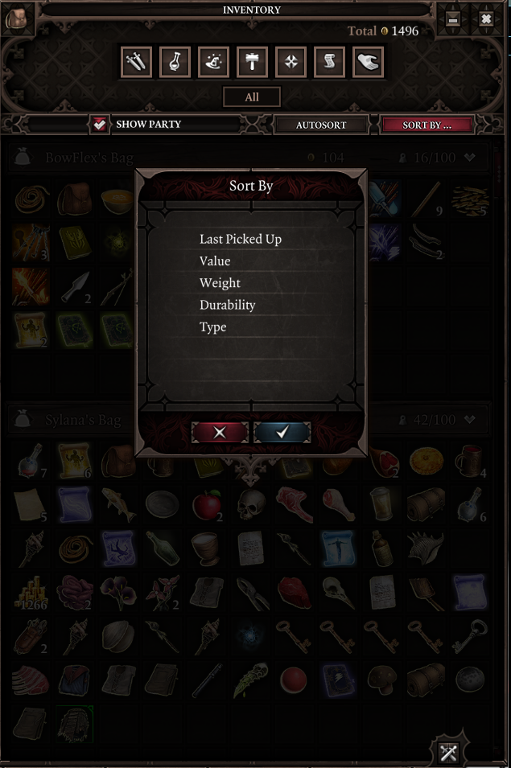

# Drill - Comparable Sorting

_(aka Pack Rat)_

**Accept this project by going here: https://classroom.github.com/a/8bw1US-U**

## Heads-up

This drill uses a different format than the other drills you've seen up to now - and this format is going to become our standard after we're done the first coding test.

The biggest differences are:
 - our work will no longer be done in the `Main` class; that class will now only be used as an entry point into an `App` class. 
 - you will be asked to create custom classes that have a specified public interface.
 - testing will be done on both console inputs/outputs **and** on classes using JUnit: the JUnit tests show that the custom classes you build are behaving correctly, while the console tests show that you know how to *use* your classes.

## Preamble

In a lot of video games, the player will have some sort of **inventory** - a collection of items they're lugging around for whatever reason.

For example, here is the inventory of a couple of characters from a game of Divinity 2 that I'm playing with some friends:

As you can see, you have the ability to **sort** the things you're carrying a variety of ways in this particular game.

We're going to make a simple inventory class that uses an array behind the scenes to hold some items. We'll add a few simple methods to this class and give the things that it holds a natural order; that way, we can take advantage of the Java `Collections` library to sort our inventory.

We'll be using what we build here in a future drill, so make sure you get this drill done!

## Time Required

JP's times:

1. importing accepted GitHub repo into Eclipse: **00:48**
2. coding passing solution: **12:13**
3. punting solution back to GitHub repo: **00:40**
4. submitting and verifying result: **01:50**

Your target time for step 2: **50 minutes**

## Skills Covered

Show you can...

- [ ] implement `equals` and `hashCode` with the IDE.
- [ ] implement a copy constructor.
- [ ] implement `Comparable<T>`.
- [ ] perform common actions you did in 1501 and 1502, like coding a constructor and a getter.
- [ ] initialize an array.
- [ ] add things to an array.
- [ ] iterate through the items in a List<T>.
- [ ] create a List<T> from an array T[] using `List.of`.
- [ ] copy an array using `Arrays.copyOf`.
- [ ] sort an ArrayList using `Collections.sort`.

## Instructions

1. Alter the `Item` class in the following ways:
   1. Implement an `equals` and `hashCode`, using the notes in the class document to guide you.
   2. Implement a copy constructor.
   3. Make `Item` implement `Comparable<Item>`, using the notes in the class document to guide you.

    **If you have done (1) correctly, all tests in `ItemTests` will pass.**

2. Complete the `Inventory` class by completing all the **// TODO** items in the class.

    **If you have done (2) correctly, all tests in all `Inventory_blahblah_Tests` files will pass.**
    
3. Complete the  **// TODO** entries in `App`.

    **If you have done (3) correctly, all tests in `MainTests` will pass.**
    
Here is an example of what a completed solution would look like in the console when run (user input in **bold**):

---
---

Here's what we have already....  
You are carrying 3 items:
- turnip(value:1)
- potion of healing(value:3)
- glaive(value:100)

Let's add a potion to our stuff....

What kind of potion did you pick up? **potion of drooling**

How much is it worth? **17**

You are carrying 4 items:
- turnip(value:1)
- potion of healing(value:3)
- glaive(value:100)
- potion of drooling(value:17)

The inventory in natural sorted order is....

You are carrying 4 items (sorted):
- glaive(value:100)
- potion of drooling(value:17)
- potion of healing(value:3)
- turnip(value:1)

---
---

> **Thoughts**
> - this is more of what future drills will be like; it may seem a little much at first, but with practice you will get used to it.

## Tests

*I think you've got a handle on `MainTests` now, so no need to talk about that.*

Since this is the first time for some (many?) of you to encounter JUnit tests, here's a quick overview.

The other java files in the `test` package are all JUnit tests. They are meant to test whether your classes behave in certain ways. Each method marked with a `@Test` will run automatically when you "run" that class in Eclipse. Just like with the `MainTests`, you want things to "run green".

If your tests **don't** run green, JUinit will give you some indication as to what went wrong and you'll have to use that information as the starting point to tracking down your problem.

